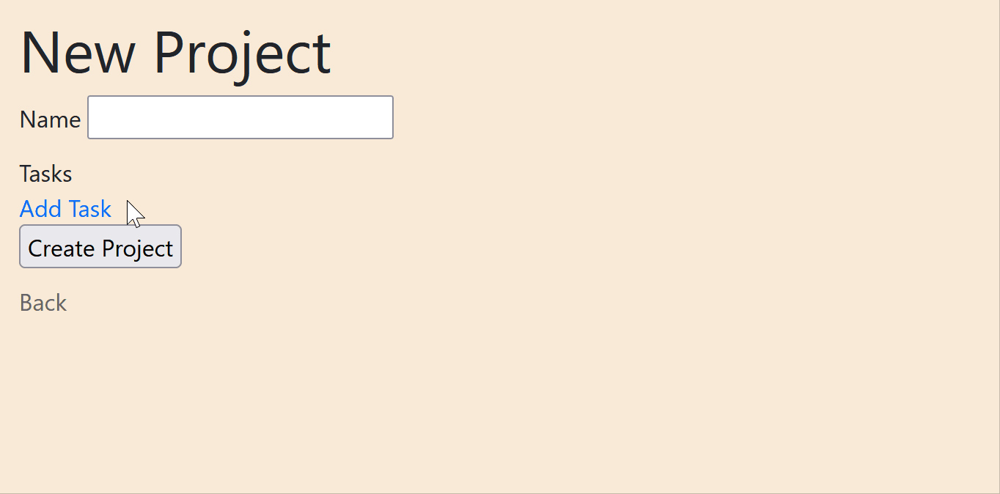

# vanilla-nested

Rails dynamic nested forms using vanilla JS

Similar to cocoon, but with no jquery dependency!

Example:



# Installation

Just add it to your gemfile

```ruby
gem 'vanilla_nested'
# or gem 'vanilla_nested', github: 'arielj/vanilla-nested', branch: :main
```

If you are using Sprockets, just require the js

```
//= require vanilla_nested
```

If you use Webpacker, add the package also (gem is required for the helper methods) using:

```sh
yarn add arielj/vanilla-nested
```

And then use it in your application.js as:

```js
import "vanilla-nested";
```

# Updating

To update the gem use either:

```
gem update vanilla_nested # if using the gem from RubyGems

# or

gem update --source vanilla_nested # if using the gem from github
```

If using webpacker, you need to update the node package too with:

```
yarn upgrade vanilla-nested
```

> You can clear the webpacker cache just in case if changes are not reflecting with `rails webpacker:clobber`

# Usage

### Backend prerequisites

```ruby
# models/order.rb
class Order < ApplicationRecord
  has_many :order_items
  accepts_nested_attributes_for :order_items, reject_if: :all_blank, allow_destroy: true
```

```ruby
# models/order_item.rb
class OrderItem < ApplicationRecord
  belongs_to :order
end
```

```ruby
class OrdersController < ApplicationController
  ...
  def order_params
    params.require(:order).permit(:attr, order_items_attributes: [:id, :attr1, :attr2, :_destroy])
  end
end
```

### Adding/Removing nested fields

```HTML+ERB
# orders/_order_item_fields.html.erb
<div class="wrapper-div">
  <%= form.text_field :attr1 %>
  <%= form.select :attr2 ..... %>
  <%= link_to_remove_nested(form) %> <!-- adds a link to add more items -->
</div>
```

```HTML+ERB
# order/form.html.erb
<%= form_for product do |form| %>
  <%= form.text_field :attr %>

  <%= link_to_add_nested(form, :order_items, '#order-items') %> <!-- adds a link to add more items -->
  <div id='order-items'>
    <%= form.fields_for :order_items do |order_item_f| %>
      <%= render 'order_item_fields', form: order_item_f %>
    <% end %>
  </div>
<% end %>
```

Note that:

- `link_to_remove_nested` receives the nested form as a parameter, it adds a hidden `[_destroy]` field
- `link_to_add_nested` expects the form builder, the name of the association and the selector of the container where the gem will insert the new fields

# Customizing link_to_add_nested

#### Link text

The default value is `Add <name of the associated model>`, but it can be changed using the parameter `link_text`:

```Ruby
link_to_add_nested(form, :order_items, '#order-items', link_text: I18n.t(:some_key))
```

This way you can, for example, internationalize the text.

#### Link classes

By default, the link to add new fields has the class `vanilla-nested-add` which is required, but you can add more classes passing a string:

```Ruby
link_to_add_nested(form, :order_items, '#order-items', link_classes: 'btn btn-primary')
```

This way you can style the link with no need of targeting the specific vanilla nested class.

#### Insert position

By default, new fields are appended to the container, you can change that with the `insert_method` option. For now, only `:append` and `:prepend` are supported:

```Ruby
link_to_add_nested(form, :order_items, '#order-items', insert_method: :prepend)
```

#### Partial name

The default partial's name is inferred using the association's class name. If your Order has_many :order_items and the class of those items is OrderItem, then the inferred name is `order_item_fields`. You can use any partial name you like, though:

```Ruby
link_to_add_nested(form, :order_items, '#order-items', partial: 'my_partial')
```

#### Form variable used in the partial

`link_to_add_nested` needs to render an empty template in order to later append/prepend it. To do that, it passes the form as a local variable. If your partial uses `form`, you don't have to do anything, but if you using another variable name, just customize it here.

```HTML+ERB
# orders/_order_item_fields.html.erb
<div class="wrapper-div">
  <%= ff.text_field :attr1 %>
  <%= ff.select :attr2 ..... %>
  <%= link_to_remove_nested(ff) # adds a link to remove the element %>
</div>
```

```Ruby
link_to_add_nested(form, :order_items, '#order-items', partial_form_variable: :ff)
```

#### Tag

The HTML tag that will be generated. An `<a>` tag by default.

```Ruby
link_to_add_nested(form, :order_items, '#order-items', tag: 'span')
```

#### Tag Attributes

HTML attributes to set for the generated HTML tag. It's a has with key value pairs user for the `content_tag` call, so it support any attribute/value pair supported by [`content_tag`](https://apidock.com/rails/ActionView/Helpers/TagHelper/content_tag)

```Ruby
link_to_add_nested(form, :order_items, '#order-items', link_text: '+', tag_attributes: {title: "Add Order"})
# <a ... title="Add Order" ... >+</a>
```

`class` attributes are appended to the `vanilla-nested-add` class and the custom classes specified with the `link_classes` argument.

```Ruby
link_to_add_nested(form, :order_items, '#order-items', link_text: '+', tag_attributes: {class: "some-class"}, link_classes: 'another-class')
# <a ... class="some-class vanilla-nested-add another-class" ... >+</a>
```

#### Link content

If you need html content, you can use a block:

```erb
<%= link_to_add_nested(form, :order_items, '#order-items') do %>
  <i class='fa fa-plus'>
<% end %>
```

# Customizing link_to_remove_nested

#### Link text

The default value is `"X"`, but it can be changed using the parameter `link_text`:

```Ruby
link_to_remove_nested(form, link_text: "remove")
```

#### Link content

If you need html content, you can use a block:

```erb
<%= link_to_remove_nested(form) do %>
  <i class='fa fa-trash'>
<% end %>
```

#### Link classes

By default, the link to remove fields has the class `vanilla-nested-remove` which is required, but you can add more classes passing a space separated string:

```Ruby
link_to_remove_nested(form, link_classes: 'btn btn-primary')
```

This way you can style the link with no need of targeting the specific vanilla nested class.

#### Fields wrapper

By default, the link to remove the fields assumes it's a direct child of the wrapper of the fields. You can customize this if you can't make it a direct child.

```HTML+ERB
# orders/_order_item_fields.html.erb
<div class="wrapper-div">
  <fieldset>
    <%= ff.text_field :attr1 %>
    <%= ff.select :attr2 ..... %>
  </fieldset>
  <span><%= link_to_remove_nested(ff, fields_wrapper_selector: 'wrapper-div') # if we don't set this, it will only hide the span %></span>
</div>
```

Note that:

- The link MUST be a descendant of the fields wrapper, it may not be a direct child, but the look up of the wrapper uses JavaScript's `closest()` method, so it looks on the ancestors.
- Since this uses JavaScript's `closest()`, there is no IE supported (https://caniuse.com/#search=closest). You may want to add a polyfill or define the method manually if you need to support it.

#### Tag

The HTML tag that will be generated. An `<a>` tag by default.

```Ruby
link_to_remove_nested(ff, tag: 'p')
```

#### Tag Attributes

HTML attributes to set for the generated HTML tag. It's a has with key value pairs user for the `content_tag` call, so it support any attribute/value pair supported by [`content_tag`](https://apidock.com/rails/ActionView/Helpers/TagHelper/content_tag)

```Ruby
link_to_remove_nested(ff, link_text: 'X', tag_attributes: {title: "Delete!"})
# <a ... title="Delete!" ... >X</a>
```

`class` attributes are appended to the `vanilla-nested-remove` class and the custom classes specified with the `link_classes` argument, just like the `link_to_add_nested` helper.

#### Undoing

You can tell the plugin to add an "undo" link right after removing the fields (as a direct child of the fields wrapper! this is not customizable!).

```Ruby
link_to_remove_nested(ff, undo_link_timeout: 2000, undo_link_text: I18n.t('undo_remove_fields'), undo_link_classes: 'btn btn-secondary')
```

Options are:

- `undo_link_timeout`: milliseconds, greater than 0 to turn the feature on, default: `nil`
- `undo_link_text`: string with the text of the link, great for internationalization, default: `'Undo'`
- `undo_link_classes`: space separated string, default: `''`

# Events

There are some events that you can listen to add custom callbacks on different moments. All events bubbles up the dom, so you can listen for them on any ancestor.

#### 'vanilla-nested:fields-added'

Triggered right after the fields wrapper was inserted on the container.

```Javascript
  document.addEventListener('vanilla-nested:fields-added', function(e){
    // e.type == 'vanilla-nested:fields-added'
    // e.target == container div of the fields
    // e.detail.triggeredBy == the "add" link
    // e.detail.added == the fields wrapper just inserted
  })
```

#### 'vanilla-nested:fields-limit-reached'

Triggered right after the fields wrapper was inserted on the container if the current count is >= limit, where limit is the value configured on the model: `accepts_nested_attributes_for :assoc, limit: 5`. You can listen to this event to disable the "add" link for example, or to show a warning.

```Javascript
  document.addEventListener('vanilla-nested:fields-limit-reached', function(e){
    // e.type == 'vanilla-nested:fields-added'
    // e.target == container div of the fields
    // e.detail.triggeredBy == the "add" link
  })
```

#### 'vanilla-nested:fields-removed'

Triggered when the fields wrapper if fully hidden (aka ""removed""), that is: after clicking the "remove" link with no timeout OR after the timeout finished.

```Javascript
  document.addEventListener('vanilla-nested:fields-removed', function(e){
    // e.type == 'vanilla-nested:fields-removed'
    // e.target == fields wrapper ""removed""
    // e.detail.triggeredBy == the "remove" link if no undo action, the 'undo' link if it was triggered by the timeout })
```

#### 'vanilla-nested:fields-hidden'

Triggered when the fields wrapper if hidden with an undo option.

```Javascript
  document.addEventListener('vanilla-nested:fields-hidden', function(e){
    // e.type == 'vanilla-nested:fields-hidden'
    // e.target == fields wrapper hidden
    // e.detail.triggeredBy == the "remove" link
  })
```

> **Remove vs Hidden**
>
> Behind the scene, the wrapper is never actually removed, because we need to send the `[_destroy]` parameter. But there are 2 different stages when removing it.
>
> - If there's no "undo" action configured, the wrapped is set to `display: none` and considered "removed".
> - If you use the "undo" feature, first the children of the wrapper are hidden (triggering the `hidden` event) and then, after the timeout passes, the wrapper is set to `display: none` (triggering the `removed` event).

#### 'vanilla-nested:fields-hidden-undo'

Triggered when the user undo the removal using the "undo" link.

```Javascript
  document.addEventListener('vanilla-nested:fields-hidden-undo', function(e){
    // e.type == 'vanilla-nested:fields-hidden-undo'
    // e.target == fields wrapper unhidden
    // e.detail.triggeredBy == the "undo" link
  })
```

## Testing

You can run the tests following these commands:

- cd test/VanillaNestedTests # move to the rails app dir
- bin/setup # install bundler, gems and yarn packages
- rails test # unit tests
- rails test:system # system tests

> If you make changes in the JS files, you have to tell yarn to refresh the code inside the node_modules folder running `./bin/update-gem` (or `yarn upgrade vanilla-nested` and `rails webpacker:clobber`), and then restart the rails server or re-run the tests.

# Version 1.1.0 Changes

#### Change the method to infere the name of the partial

Before, it used `SomeClass.name.downcase`, this created a problem for classes with more than one word:

- User => 'user_fields'
- SomeClass => 'someclass_fields'

Now it uses `SomeClass.name.underscore`:

- User => 'user_fields'
- SomeClass => 'some_class_fields'

If you used the old version, you'll need to change the partial name or provide the old name as the `partial:` argument.

#### Fix some RuboCop style suggestions

Mostly single/double quotes, spacing, etc.

#### Added some Solagraph related doc for the view helpers

Just so Solargraph plugins on editors like VS-Code can give you some documentation.

#### Added some documentation on the code

Mostly on the javascript code

#### Added node module config

So it can be used as a node module using yarn to integrate it using webpacker.

# Version 1.2.0 Changes

#### New event for the "limit" option of `accepts_nested_attributes_for`

You can listen to the `vanilla-nested:fields-limit-reached` event that will fire when container has more or equals the amount of children than the `limit` option set on the `accepts_nested_attributes_for` configuration.

# Version 1.2.1 Changes

#### Removed "onclick" attribute for helpers and add event listeners within js

If you were using webpacker, remember to replace the vanilla_nested.js file in your app/javascript folder

# Version 1.2.2 Changes

#### Added "link_classes" option to "link_to_remove_nested"

You can set multiple classes for the "X" link

#### Added a "link_content" block parameter for both link helpers

You can pass a block to use as the content for the add and remove links

# Version 1.2.3 Changes

#### Fix using nested html elements as the content for buttons

There was an error when using the helpers with things like:

```erb
<%= link_to_add_nested(form, :pets, '#pets') do %>
  <span>Add Pet</span>
<% end %>
```

It would detect the wrong element for the click event, making the JS fail.

# Version 1.2.4 Changes

Play nicely with Turbolinks' `turbolinks:load` event.

# Version 1.2.5 Changes

License change from GPL to MIT

# Version 1.3.0 Changes

#### Custom generated HTML element tag

The default HTML tag generated by `link_to_add/remove_nested` is an `A` tag, but it can now be customized with the `tag:` keyword argument:

```erb
<%= link_to_add_nested(form, :pets, '#pets', tag: 'span') %>
```

#### Extra class added to dynamically added fields

Elements added dynamically now have an extra `added-by-vanilla-nested` class, used internally and helpful for styling.

#### Removed elements are actually removed from the document

Before, the elements were just hidden using `display: none` on the wrapper. That lead to issues when the input elements had validations that were triggered by the browser but the elements where not accessible anymore. With this new version, removing a nested set of fields removes all the content.

#### Correct calculation for the limit-reached event

If the `accepts_nested_attributes_for` configuration has a limit, this gem was counting the number of children wrong (it was counting removed elements and extra children of the wrapper). This fixes that by only counting the `[_destroy]` hidden fields with value `0`.

# Version 1.4.0 Changes

#### Custom HTML attributes for the generated HTML element tag

Both `link_to_add_nested` and `link_to_remove_nested` now support a `tag_attributes` keyword argument with key value pairs representing attributes and values for the generated HTML tag.

You can use this to customize the tag as you need:

- you can add a `title` for your `a` tag to make them more accessible:

```Ruby
link_to_remove_nested(ff, link_text: 'X', tag_attributes: {title: "Delete!"})
# <a ... title="Delete!" ... >X</a>
```

- you can set a `type`, `name` and `value` for a `button` tag if you want to have a non-javascript submit action to fallback in case the user has Javascript disabled:

```Ruby
link_to_add_nested(form, :order_items, '#order-items', tag: 'button', tag_attributes: {type: 'submit', name: 'commit', value: 'add-nested' })
# now you have a button tag that will submit your form with a `commit` param with `add-nested` as the value to handle a non-javascript fallback to add nested fields an re-render the form!
```

- you can set any valid html attribute accepted by [`content_tag`](https://apidock.com/rails/ActionView/Helpers/TagHelper/content_tag)

> Remember to update both gem and package https://github.com/arielj/vanilla-nested#update

# Version 1.5.0 Changes

#### Added Integration with the `turbo` Gem

The JavaScript part of the gem now plays nicely with the `turbo` gem by initializing the needed events when the `turbo:load` event is fired.
